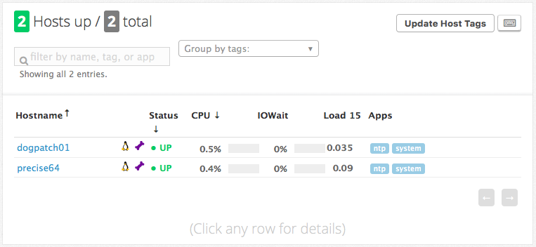
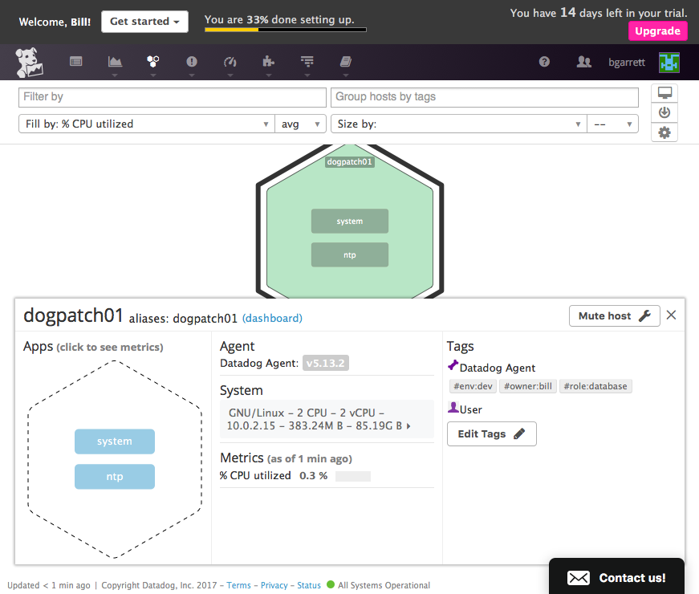

# Bill Garrett's Technical Exercise

These are answers from Bill Garrett (bgarrett@sonic.net) to the Solutions Engineer exercise, June 2017.

*Still is a work in progress!*

## Level 0 - Setting up an Ubuntu VM
I used the instructions provided to set up a fresh Ubuntu VM with Vagrant and connected to run a few quick smoke tests.

## Level 1 - Collecting Data

I installed an agent in my environment. Here's a screenshot from the Infrastructure dashboard:



There are two hosts here because I changed the hostname after seeing how it appears. Hashicorp's default of 'precise64' seemed dull, so I went with the more apropos dogpatch01. [Why dogpatch?](#the-dogpatch)

### What is an agent?

**Executive explanation:** DataDog's agent is a light-weight service
that runs on each of your systems, collecting configurable metrics,
and sending them to DataDog's hosted service to display shareable,
customizable dashboards and reports.

**Techie addition:** The agent is a service, a set of daemon processes, that runs on each of your systems. For example, on a Linux system you'll see these processes:
```
root@dogpatch01:~# ps -ef | grep -i datadog
dd-agent   809     1  0 17:18 ?        00:00:00 /opt/datadog-agent/embedded/bin/python /opt/datadog-agent/bin/supervisord -c /etc/dd-agent/supervisor.conf --pidfile /opt/datadog-agent/run/datadog-supervisord.pid
dd-agent   813   809  0 17:18 ?        00:00:00 /opt/datadog-agent/bin/trace-agent
dd-agent   814   809  0 17:18 ?        00:00:01 /opt/datadog-agent/embedded/bin/python /opt/datadog-agent/agent/ddagent.py
dd-agent   815   809  0 17:18 ?        00:00:01 /opt/datadog-agent/embedded/bin/python /opt/datadog-agent/agent/dogstatsd.py --use-local-forwarder
dd-agent   818   809  0 17:18 ?        00:00:01 /opt/datadog-agent/embedded/bin/python /opt/datadog-agent/agent/agent.py foreground --use-local-forwarder
root      1683  1628  0 17:25 pts/0    00:00:00 grep --color=auto -i datadog
```
The agent is installed in `/opt/datadog-agent`.
The main configuration file is `/etc/dd-agent/datadog.conf`.

### Adding tags

I found the tag settings in `/etc/dd-agent/datadog.conf`. After a bit of experimentation and searching to learn how they work I settled on changing them to:
```
# Set the host's tags (optional)                                                                
tags: owner:bill, env:dev, role:database
```

Here's a screenshot of the host map showing these tags:



### Monitoring Postgres

I installed Postgres on my machine and added monitoring for it. See the following section for a simple dashboard I created.

### Custom Agent Check

I followed the instructions at http://docs.datadoghq.com/guides/agent_checks/ to create a custom agent check. Here's my (simple) code:

`/etc/dd-agent/conf.d/random.yaml`:
```
init_config:

instances:
    [{}]
```

`/etc/dd-agent/checks.d/random.py`:
```
import random
from checks import AgentCheck
class RandomCheck(AgentCheck):
    def check(self, instance):
        self.gauge('test.support.random', random.random())
```

Here's a screenshot of a simple timeboard I put together showing activity in my Postgres database and values from the random check:


## Level 2 - Visualizing Data

### Clone dashboard and add metrics

I cloned my original Basic TimeBoard and added a few extra metrics to it. The new version is called Slightly Less Basic Timeboard. :wink:


### TimeBoards vs. ScreenBoards

To answer the question about the difference between timeboards and screenboards I figured first I'd try creating a screenboard
to see how it work. Right away it leapt out at me that screenboards substantially more control over visual layout. Here's a basic
screenboard I created as I explored the functionality:


Screenboards seem to include all widgets available in timeboards plus several extra, including image and note.

Next I decided to search for a more authoritative description, such as a manual. The \#2 hit on my Google search was
the company's blog post from a few years ago introducing the feature:

https://www.datadoghq.com/blog/introducing-screenboards-your-data-your-way/

It confirmed that the purpose of screenboards is to provide customized layout control not offered in the dashboard feature. It
noted that customers were clamoring for more control, going so far as to use other dashboarding tools and populate them with
data from Datadog. Screenboards are certainly an improvement!

### Snapshot and @notification

Doing this next!

## Level 3 - Alerting Data

Doing this next+1.

# Color Commentary & Notes

### Virtualization & Automation *Rock*
I remember ~10 years ago when virtualization was first taking hold across companies for production infrastructure.
I worked for a small company at the time that had been doubling year over year for a few years. For us virtualization
was the most cost effective solution to handle all that doubling-- doubling of staff, doubling of products in the
portfolio, doubling of versions and platforms to support, etc.-- without more than doubling our costs.
We had already gone through the costly exercises of adding electric capacity to our server room and, subsequently,
adding cooling capacity-- which included not just HVAC parts and technicians but a crane operator (to put the
equipment on the roof!) and the all the safety permits, inspectors, and signoffs that go along with that.

### The Dogpatch
The Dogpatch is a neighborhood in San Francisco, south of Giants Stadium. It's a newly hip area that tech firms have been moving to in recent years.


