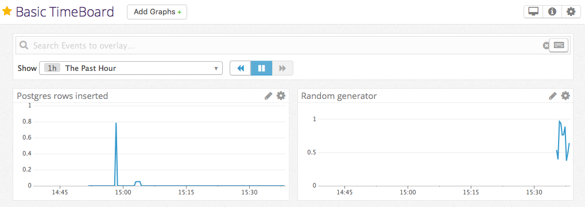

# Bill Garrett's Technical Exercise

These are answers from Bill Garrett (bgarrett@sonic.net) to the Solutions Engineer exercise, June 2017.

*Still is a work in progress!*

## Level 0 - Setting up an Ubuntu VM
I used the instructions provided to set up a fresh Ubuntu VM with Vagrant and connected to run a few quick smoke tests.

## Level 1 - Collecting Data

I installed an agent in my environment. Here's a screenshot from the Infrastructure dashboard:


There are two hosts here because I changed the hostname after seeing how it appears. Hashicorp's default of 'precise64' seemed dull, so I went with the more apropos dogpatch01. [Why dogpatch?](#the-dogpatch)

### What is an agent?

**Executive explanation:** DataDog's agent is a light-weight service
that runs on each of your systems, collecting configurable metrics,
and sending them to DataDog's hosted service to display shareable,
customizable dashboards and reports.

**Techie addition:** The agent is a service, a set of daemon processes, that runs on each of your systems. For example, on a Linux system you'll see these processes:
```
root@dogpatch01:~# ps -ef | grep -i datadog
dd-agent   809     1  0 17:18 ?        00:00:00 /opt/datadog-agent/embedded/bin/python /opt/datadog-agent/bin/supervisord -c /etc/dd-agent/supervisor.conf --pidfile /opt/datadog-agent/run/datadog-supervisord.pid
dd-agent   813   809  0 17:18 ?        00:00:00 /opt/datadog-agent/bin/trace-agent
dd-agent   814   809  0 17:18 ?        00:00:01 /opt/datadog-agent/embedded/bin/python /opt/datadog-agent/agent/ddagent.py
dd-agent   815   809  0 17:18 ?        00:00:01 /opt/datadog-agent/embedded/bin/python /opt/datadog-agent/agent/dogstatsd.py --use-local-forwarder
dd-agent   818   809  0 17:18 ?        00:00:01 /opt/datadog-agent/embedded/bin/python /opt/datadog-agent/agent/agent.py foreground --use-local-forwarder
root      1683  1628  0 17:25 pts/0    00:00:00 grep --color=auto -i datadog
```
The agent is installed in `/opt/datadog-agent`.
The main configuration file is `/etc/dd-agent/datadog.conf`.

### Adding tags

I found the tag settings in `/etc/dd-agent/datadog.conf`. After a bit of experimentation and searching to learn how they work I settled on changing them to:
```
# Set the host's tags (optional)                                                                
tags: owner:bill, env:dev, role:database
```

Here's a screenshot of the host map showing these tags:


### Monitoring Postgres

I installed Postgres on my machine and added monitoring for it. See the following section for a simple dashboard I created.

### Custom Agent Check

I followed the instructions at http://docs.datadoghq.com/guides/agent_checks/ to create a custom agent check. Here's my (simple) code:

`/etc/dd-agent/conf.d/random.yaml`:
```
init_config:

instances:
    [{}]
```

`/etc/dd-agent/checks.d/random.py`:
```
import random
from checks import AgentCheck
class RandomCheck(AgentCheck):
    def check(self, instance):
        self.gauge('test.support.random', random.random())
```

Here's a screenshot of a simple timeboard I put together showing activity in my Postgres database and values from the random check:



## Level 2 - Visualizing Data

# Color Commentary & Notes

### The Dogpatch
The Dogpatch is a neighborhood in San Francisco, south of Giants Stadium. It's a newly hip area that tech firms have been moving to in recent years.


